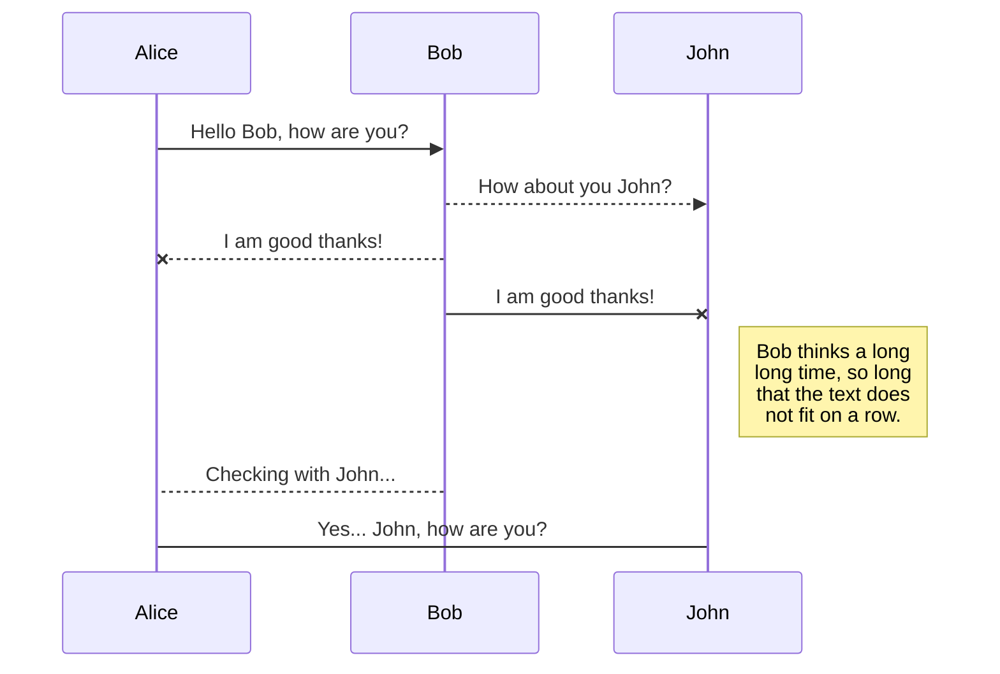
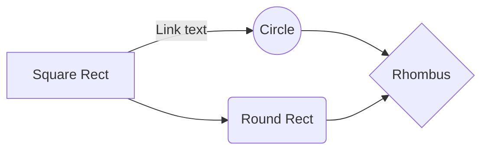

# STEEReoCAM

  

STEEReoCAM is a Stereo Vision camera for NVIDIA® Jetson TX2/AGX Xavier platform from e-con Systems, a leading Embedded Product Design Services company which specializes in the advanced camera solutions. It is based on OV2311 - global shutter monochrome image sensor from OmniVision.

  
  

# Getting Started

  

Prerequisities:

- Host PC with 18.04 (64-bit) to flash the binaries in Jetson TX2/AGX Xavier development kit.

- Jetpack version 4.2.2 (Strongly recommand), if you have some trouble in Jetpack version, see (optional).

  

  

## Driver installation

  

Download the release package in https://developer.e-consystems.com/, and copy that into the home directory of the Jetson Xavier.

- Extract the release package in the Jetson Xavier to obtain the binaries.

```

tar -xampf e-CAM20_Stereo_CUMI2311_TX2_JETSON_<L4T_Version>_<release_date>_<release_version>.tar.gz

cd e- CAM20_Stereo_CUMI2311_TX2_JETSON_<L4T_Version>_<releas e_date>_<release_version>

```

- Run the following commands to install the binaries.

```

sudo chmod a+x ./install_binaries_<version>.sh

sudo ./install_binaries_<version>.sh

```

This script will reboot the Jetson Xavier automatically after installing the binaries successfully.

- Run the following command to check if the driver has been installed successfully.

```

ls /dev/video*

```

The output message appears as shown below.

```

video0

```

## Installing TaraXL SDK

  

This section describes the steps to install SDK on Jetson Xavier.

>The release package contains accelerated SDK binary that can run on NVIDIA® TX2 board. Before installing SDK, please check whether CUDA is installed.

  

Run the following command to confirm whether CUDA framework is available in your device.

'#nvcc -V'


  

## (Optional) How to flash old version of Jetpack

  

In order to flash Jetpack 4.2.2 on your Xavier, you should follow as below.

  

- Step 1. Install SDK mannager on your host PC. Download [sdkmanager_1.3.0-7105](https://developer.nvidia.com/sdkmanager-130-7105-amd64  "sdkmanager-1.3.0-7105") and install.

> sudo apt install ./sdkmanager_1.3.0-7105_amd64.deb

- Step 2. After installing the SDK manager in yout host PC, follow the instructions in the link below to run the SDK manager and flash the Jetson kit with Jetpack 4.2.2.

https://docs.nvidia.com/sdk-manager/install-with-sdkm-jetson/index.html

However, if Jetpack 4.2.2 does not appear in your SDK manager, open your terminal and command as below.

> sdkmanager --archivedversions

  
  
  
  


# ROS extensions

  

StackEdit extends the standard Markdown syntax by adding extra **Markdown extensions**, providing you with some nice features.

  

>  **ProTip:** You can disable any **Markdown extension** in the **File properties** dialog.

  
  

## SmartyPants

  

SmartyPants converts ASCII punctuation characters into "smart" typographic punctuation HTML entities. For example:

  

| |ASCII |HTML |

|----------------|-------------------------------|-----------------------------|

|Single backticks|`'Isn't this fun?'` |'Isn't this fun?' |

|Quotes |`"Isn't this fun?"` |"Isn't this fun?" |

|Dashes |`-- is en-dash, --- is em-dash`|-- is en-dash, --- is em-dash|

  
  

## KaTeX

  

You can render LaTeX mathematical expressions using [KaTeX](https://khan.github.io/KaTeX/):

  

The *Gamma function* satisfying $\Gamma(n) = (n-1)!\quad\forall n\in\mathbb N$ is via the Euler integral

  

$$

\Gamma(z) = \int_0^\infty t^{z-1}e^{-t}dt\,.

$$

  

> You can find more information about **LaTeX** mathematical expressions [here](http://meta.math.stackexchange.com/questions/5020/mathjax-basic-tutorial-and-quick-reference).

  
  

## UML diagrams

  

You can render UML diagrams using [Mermaid](https://mermaidjs.github.io/). For example, this will produce a sequence diagram:

  



  

And this will produce a flow chart:

  

